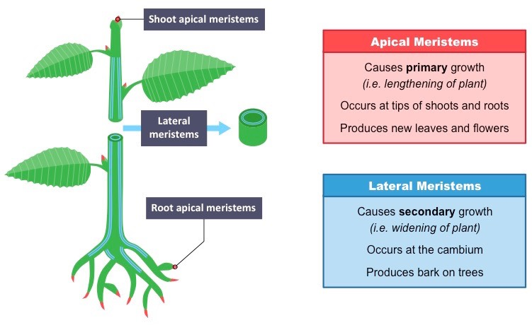
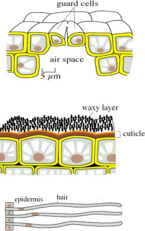
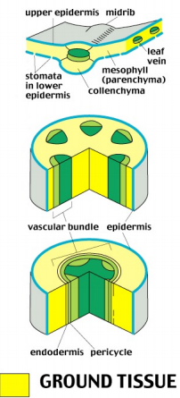
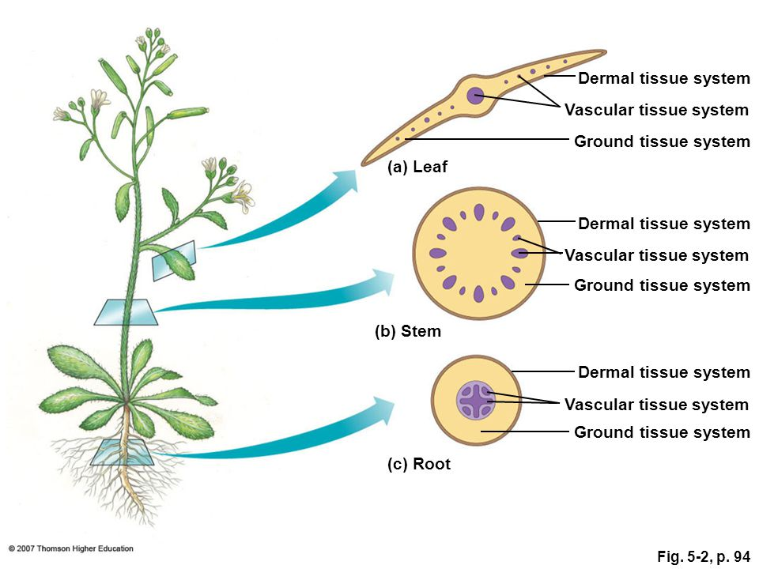

### Lecture 3: Cells and Tissues Continued and Primary Stem Growth
>Reading:
[] 1. 107-115 (Parenchyma, Collenchyma, and  Sclerenchyma),
[] 2. 115-120 (External Organization of Stems)
[] 3. 120-132 (Internal Organization of Stems)

#### Tissue Overview

##### Meristems
+ Apical meristems
  - causes primary growth (lengthening of plant)
  - occurs at tips of shoots and roots
  - Produces new leaves and flowers

+ Lateral meristems
  - Causes secondary growth (widening of plant)
  - Occurs at the cambium
  - Produces bark on trees

##### Three Main Tissues
1. Epidermal(stomata, trichomes)
+ The dermal tissue system is the outer covering of the plant.
+ Outermost Layer of cells
+ More than one cell type
+ Covered with a waxy cuticle layer to prevent water loss
+ Guard cells from stomata
+ Trichomes - hairs
  + Sundews have glandular trichomes that act as fly paper

2. Ground(Parenchyma, collenchyma, sclerenchyma[fibers and sclereids])
+ The ground tissue system carries out photosynthesis, stores photosynthetic products, and helps support the plant.
+ Called Cortex in Mauseth Book
+ Present in most organs of the plant
+ Simple tissues are made one type of cell
+ Complex tissues are made up of two or more cell types

#### Simple Tissues
*Parenchyma tissue*
+ Living at maturity
+ Thin primary cell walls
+ Large Central vacuole
+ Can take on many shapes
+ Function in photosynthesis, storage, and transport of food and water

*Collenchyma*
+ Composed of living cells with thick primary cell walls
+ Flexible support for organs such as leaves and herbaceous stems

*Sclerenchyma tissue*
+ Dead at maturity
+ Thick and rigid secondary cell walls
+ Function in support and protection
+ Two Typ: sclereids and fibers

Fibers
+ Fibers are elongaged sclerenchyma cells that provide structural rigidity and stiffenting for leaves, stems, and roots.

Sclereids
+ Sclereids (stone cells) form the hard tissues of nuts, seed coats, etc.
+ They may also be present together with thin-walled parenchyma cells.

3. Vascular(Xylem[tracheids and vessel elements], phloem[sieve and memebers and companion cells])
+ The vascular tissue system conducts water and solutes through out the plant.
+ Continuous tissue throughout the plant in which substances are transported
+ Complex tissues, made of numerous cells type
+ Xylem and phloem

Xylem
+ Functions: transport water and mineral salts
+ Composed of different types of Cells
  + Vessel elements - long tubular cells open at both ends, arranged end to end forming vessels that function like water pipe
  + Tracheids - tapered at the ends but do not have holes at the ends, water passes from tracheids to tracheid through thin area in the cell wall called pit.
  + Xylem fibers
  + Xylem parenchyma

Phloem
+ Function: transport sugars and other organic substances
+ Composed of different types of cells
  + Sieve tube elements - long tubular cells with sieve plats in the end walls, arranged end to end, alive but lacking a nucleus
  + Companion cells - help sieve tube memebers functions
  + Phloem fibers
  + Phloem parenchyma

