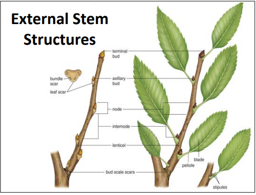

### Lecture 4: Primary and Secondar Stem Growth

> Reading:
[] 1. 115-120 (External Organization of Stems)
[] 2. 189-204 (Structure of Woody Plants), stop at secondary phloem

#### Primary plant body and meristems

#### External stem structure
#### Internal stem structure
#### Types of plants (monocots, eudicots)
#### Modified stems
#### Secondar Growth - how woody plants and trees form

#### Plant of the week
Coast Live Oak (Quercis agrifolia)
+ Dominates coast live oak woodlands
+ It is restricted to coastal areas from Sonoma County south into Baja California
+ At times, acorns constitued the primary daily food for more that 3/4 of all native americans
+ Native Californians crushed acorns in bedrock mortas
+ After acorn meal was made, the toxic tannins were leached out with water.

#### Function of Stem
+ Transport - Stem faciliates transport through the vascular tissues
+ Support - The Stem holds leaves up in a position for efficient photosynthesis.

#### Stem Structure
+ The Apical meristem produces tissues that grow into mature stem and leaf tissues.
+ Leaves are attached at nodes. One or more leaves occur at each node.
+ Internodes are space between each node.
+ A bud occurs in the axil of each leaf, called the axillary bud.
  - Axillar buds grow into new leaf stems or flowers.

#### Deciduous Stem
Deciduous - plant structures that fall off naturall at the end of a growing period, e.g., leaves that fall seasonally or plants that are seasonlly leafless.