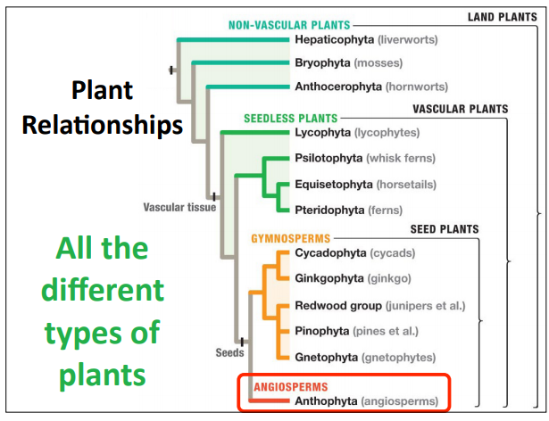

### Lecture 5: Secondary Growth

> Reading:
[] 1. 189-210 (Structure of Woody Plants), stop at secondary growth in Roots

#### What is Monocot?
+ Lilies
+ Palm Trees
+ Grasses
+ Orchids

| | Monocot | Dicot|
--|---------|------|
Flowers | Flowers parts are in threes or multiples of three. | Flower parts are in four or five or multiples of four or five.
Leaves | Leaves have smooth edges and often narrow shaped with parallel veins. | Leaves are oval or palmate (handlike) shape with netlike vein.
Vascular Tissues | Vascular bundels are scattered through stem. | Vascular bundles are arranged in a ring around stem.
Root Pattern | Monocots have a fibrous root system. | Dicots have a taproot system
Embryo in Seed | The monocot embryo has one cotyledon (seed leaf) | The dict embryo has two cotyledon (seed leaves)

#### Hemp (Cannabis sativa)
+ Plants Produce very little THC
+ Grown for rope, paper, clothing, fiber paneling, sailcloth, nutritional products
+ Valuable and nutritional oil comes from the fruti "seeds"
+ Strong and resistant to water and sea water
+ 80% produced in China

#### Natural Fibers
+ Flax (Linum usitatissimum)
+ Linen,linseed oil, and paper

#### Modified Stems
+ Stolons produce new individuals at nodes above ground.
+ Rhizomoes produce new individuals at nodes below ground.
+ Succulents - Often round, or thickened water storing stems
+ Tuber - The swollen end of an underground stem. Function: Nutrient Storage (Potato)

#### Pointy Structures On plants
+ Thorn - Modified branch that comes from an axillary bud
+ Spine - Modified leaf that comes fromo below the axillary bud
+ Prickle - Epidermal outgrows taht occur at randomw on the stem (not necessarily at nodes)

#### Seasonal Growth Patterns
+ Annuals:
  + Most herbaceous plants that demonstrate only primary growth
  + Entire life cycle takes place in one growing season
+ Biennials:
  + Need two seaons from germination to seed formation
+ Perennials:
  + Plants that live year after year
  + Woody plants that display secondary growth in their stem
  + Monocots have no true secondary growth.
  + After several years of growth, perennial plants start to form woody (secondary tissues) and roots and stems get wider.
  + Secondary growth  = Formation of wood and wideniung of stems and roots.

#### Meristem
+ where growth occurs
+ Primary Growth
  + Apical Meristem
  + Primary tissues increase in length
+ Secondary Growth
  + Lateral meristems
  + Secondary tissues increase in girth

#### Cork
+ Commerical cork - Cork Oak (Quercus suber) bark
+ Bottle stoppers, musical instruments, fishing floats, insulation, tiles, flooring, cork boards
+ Cork cells that are impreganated with subrin wax
+ Mostly grown in Portugal, other Mediterranean contries.
+ In 1600's, a French monk named Dom Perignon started using cork as wine closures.

